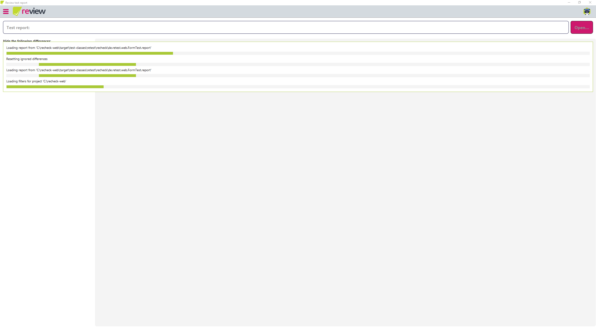
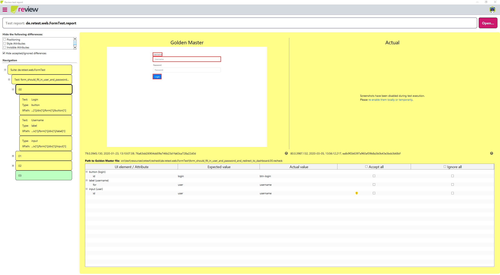

# Version 1.10.0

Welcome to version 1.10.0 of [***recheck***](https://github.com/retest/recheck/blob/master/CHANGELOG.md), [***recheck-web***](https://github.com/retest/recheck-web/blob/master/CHANGELOG.md), [***recheck.cli***](https://github.com/retest/recheck.cli/blob/master/CHANGELOG.md) and ***review***. For more information, please refer to the specific changelogs.

We worked hard on new features to improve your workflow:

1. [**Improved Filter Rules**](#improved-filter-rules): Improved chaining of expressions and add more rules.
2. [**Improved Report Output**](#improved-report-output): Improved formatting and display retestId.
3. [**Improved review User Experience**](#improved-review-user-experience): Improved performance and user feedback.
4. [**Add `account` and `diff` Command**](#add-account-and-diff-command): Manage account and compare Golden Masters.s
5. And as always general [improvements](#improvements) and [bug fixes](#bug-fixes).

## Improved Filter Rules

This feature is available within ***recheck***, and works for both ***review*** and ***recheck.cli***. For more information, please refer to the [documentation](https://docs.retest.de/recheck/usage/filter/).

We improved the filter rules to allow for more options when ignoring differences for your tests. This contains:

1. Improved chaining of expressions.
2. Ignore specific values of differences.
3. Ignore small color fluctuations.
4. Ignore inserted or deleted elements.

This comes with the following bug fixes:

1. Element matching using `matcher: $key=$value` now ignores the whole subtree. This is now also the case when chaining this element with other expressions (most notably using attributes).

### Improved chaining of Filters

Filters are build up using expressions that query one individual part of a difference.

```yml
# The element where the difference occured
$element
# The attribute changed
$attribute
# The value that has changed
$value
```

Along side with some other expressions:

```yml
# The change occured (inserted/deleted)
$change
# Pixel values that changed (position, size, ...)
$pixel-diff
# Color value that changed (background, border, ...)
$color-diff
```

Prior to 1.10.0, it was only possible to chain `$element, $attribute`. This has now been expanded, to allow almost any combination of expressions. As expressions are read left to right, those will need to be ordered accordingly; from more generic to more specific (e.g `$element, $attribute, $value`). For a full overview, please visit the [documentation](https://docs.retest.de/recheck/usage/filter/#expressions).

```yml
# Match an attribute for a specific element
$element, $attribute
# Match a specific value of an elements' attribute
$element, $attribute, $value
# Match a specific value for all attributes of an element
$element, $value
# Match the element only if it is inserted
$element, $inserted
# Match the element only if it is removed
$element, $deleted
# Match a specific value of an attribute for all elements
$attribute, $value
```

### Ignore Elements

Ignoring elements with `matcher: $key=$value` will now always look for parents that match the specified condition. That means that the filter expression will match the whole sub-tree.

In the below example the filter will now match all children. If any text changes within the `section` element, the filter matches this difference&mdash;even if the it is a child element.

```
matcher: id=section, attribute=text
```

```html
<section id="section">
    <p>This is some text</p>
    <p>This another text</p>
</section>
```

#### Ignore Inserted or Deleted Elements

If you are not interested in inserted or deleted elements, but still want to get notified if the attributes of the specified elements change, you can ignore those changes. This is useful for lists similar where you do not care if an element is inserted, but do care if the font or color changes.

```
# Globally ignore insertions or deletions
change=inserted
change=deleted

# Ignore only insertions deletions within the element
matcher: id=section, change=inserted
matcher: id=section, change=deleted
```

### Ignore Values

If you want to ignore a specific value while still being notified about any other changes, you can specify a `value-regex`. This is helpful if you want to ensure that the value has a specific patter (e.g. date format) but do not care about the concrete value (because it is changing each day).

```
# Match all attributes that look like a date format (dd.MM.yyyy)
value-regex=\d\d.\d\d.\d\d\d\d
```

#### Ignore color-diff

Similarly to the pixel differences, it is possible to ignore small color differences. This is most useful to ignore small differences for color animations.

```
color-diff=5%
```

Each color component (red, green, blue) is reviews in isolation. Changing only the red component from `255` to `127` would result in a color difference of 50%.

> If you have any improvement ideas and feature requests, we are happy to hear them.

## Improved Report Output

This feature is available within ***recheck***, and works for ***recheck.cli***.

```text
1 check(s) in 'de.retest.web.FormTest' found the following difference(s):
Test 'form_should_fill_in_user_and_password_and_redirect_to_dashboard' has 5 difference(s) in 1 state(s):
00 resulted in:
	Metadata Differences:
	  Please note that these differences do not affect the result and are not included in the difference count.
		browser.version:
		  expected="79.0.3945.130",
		    actual="80.0.3987.132"
	button (login) at 'html[1]/body[1]/div[1]/div[1]/form[1]/button[1]':
		id:
		  expected="login",
		    actual="btn-login"
	label (username) at 'html[1]/body[1]/div[1]/div[1]/form[1]/div[1]/label[1]':
		for:
		  expected="user",
		    actual="username"
	input (user) at 'html[1]/body[1]/div[1]/div[1]/form[1]/div[1]/input[1]':
		id:
		  expected="user",
		    actual="username"
		border-bottom-color:
		  expected="rgb(128, 189, 255)",
		    actual="rgb(188, 207, 227)"
		box-shadow:
		  expected="rgba(0, 123, 255, 0.25) 0px 0px 0px 3.2px",
		    actual="rgba(0, 123, 255, 0.06) 0px 0px 0px 0.74162px"
```

### Improved Formatting

The expected and actual values for an attribute difference are now displayed beneath each. This allows for a up-to-down comparison which makes it easier to spot the difference.

```
button (login) at 'html[1]/body[1]/div[1]/div[1]/form[1]/button[1]':
		id:
		  expected="login",
		    actual="btn-login"
```

### Show the retestId

The retestId for an element is now shown in parentheses next to the tag name.

```
button (login) at 'html[1]/body[1]/div[1]/div[1]/form[1]/button[1]'
 |       |          |
type    retestId   xpath
```

The retestId (e.g. `login`) can be used to have unbreakable identifiers using `de.retest.web.selenium.By#retestId(String)` or in filters `matcher: retestid=login`.

## Improved review User Experience

This feature is available in ***review***.

### Improved ***review*** performance:

The performance has been greatly improved when accepting/ignoring single or multiple differences. This should allow you for easy

### Report Dialog

The report dialog will now open faster while retrieving the report files from ***rehub*** in the background. Secondly, the dialog will now be larger to allow longer report names to be visible.
    


### Loading Report Progress

The progress of loading a report, along with its related tasks is now better reflected by waiting until all tasks are done. This will display the progress bar on loading so long, until ***review*** is ready to display the newly loaded report.



Most of the time, you will not see these progress bars displayed as the loading is generally fast. However, after the loading has finished and while ***review*** is rendering the report, the progress bar will stay visible to indicate that there is still processes going on in the background.

### Show the retestId

Similar to the report output for a test execution or the ***recheck.cli***, the difference view in review will now also display the retestId for an element.



## Add `account` and `diff` Command

This feature is available in ***recheck.cli***. For more information, please refer to the command help `recheck --help`.

### Manage your retest Account

This command allows you to manage your ***retest*** account via the command line. This can be used to create and retrieve `RECHECK_API_KEYs` which can be used within your continuous integrations.

```bash
recheck account [login|logout|show]
```

### Compare Golden Masters Manually

This commands allows you to compare two Golden Masters manually. You can specify two Golden Masters paths to compare which do not need to be in the same project.

```bash
recheck diff [--output=<directory>] [--exclude=<exclude>]... <goldenMasterPath>...
```

## Improvements

* Add the possibility to explicitly generate and retrieve an API key (***review***).
* Replace the internal dependency to Jackson (which often caused trouble) with SnakeYAML (***recheck-web***).
* Enable ANSI on Windows and apply custom color scheme to usage messages (***recheck.cli***).

## Bug fixes

* Fixed class filtering when using `matcher: class=foo bar` was not working correctly as a subset (***recheck***).
* Screenshots for elements will now honor the `de.retest.recheck.web.screenshot.provider` property (***recheck-web***).
* Fix passing elements from an `UnbreakableDriver` into an `RecheckWebImpl` throw an error (***recheck-web***).