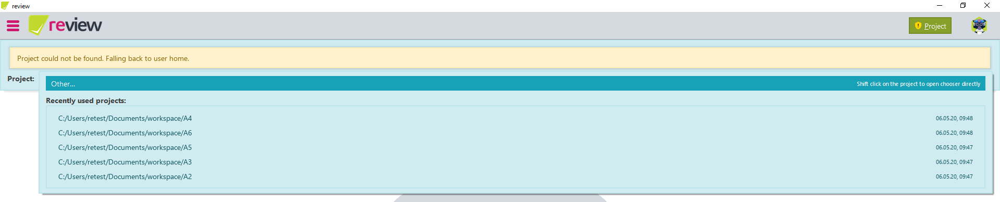
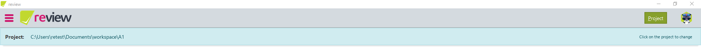
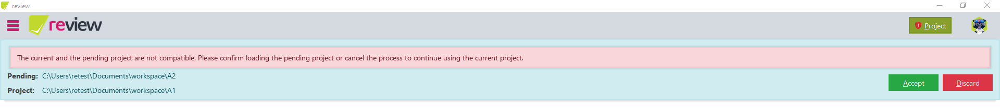

# Version 1.11.0

Welcome to version 1.11.0 of [***recheck***](https://github.com/retest/recheck/blob/master/CHANGELOG.md), [***recheck-web***](https://github.com/retest/recheck-web/blob/master/CHANGELOG.md), [***recheck.cli***](https://github.com/retest/recheck.cli/blob/master/CHANGELOG.md) and ***review***. For more information, please refer to the specific changelogs.

We worked hard on new features to improve your workflow:

1. [**Add project management**](#project-management): Change automatically discovered projects to fit the current report.
2. [**Return of 1-click-maintenance**](#1-click-test-maintenance): Similar differences are applied together.
3. [**Highlighted report output**](#highlighted-report-output): The ***recheck.cli*** will now highlight any report output.
4. [**Stabilize report uploads**](#report-upload-stabilization): Improved report uploads to rehub.
5. [**Implicit skip checks**](#implicit-skip-checks): Improved performance and user feedback.
6. Some [breaking changes](#breaking-changes).
7. And as always general [improvements](#improvements) and [bug fixes](#bug-fixes).

## Project Management

This feature is available in ***review*** with at least a standard license. For more information, please refer to the [documentation](https://docs.retest.de/review/usage/projects).

To accept changes for a Golden Master, ***review*** requires a correct project to be available. While it tries to search for such a project, it might not be always able to find one. In such a case, you can now choose from a list of recently used projects or select a project directly from your file system.





Furthermore, if ***review*** automatically discovers a project, it will intelligently load the discovered project. Should loading the project result in a destructive operation (e.g. overwrite the active project), the discovered project will be set to pending. An error will be displayed and ***review*** will ask for confirmation to continue or abort the loading process. If you decide to discard the change, the pending project will not be loaded.



If you select a recently used project from the list, the active project will be overwritten without the need to confirm the change.

## 1-click Test Maintenance

This feature is available in ***review***. For more information, please refer to the [documentation](https://docs.retest.de/review/usage/reports).

When accepting or ignoring differences, ***review*** will now look through all checks for the same difference on the same element, cutting down the time to maintain the Golden Master significantly.

This is especially helpful if you performed multiple tests on the same website (e.g. using multiple resolutions, cross-browser, &hellip;) or different websites that share similar elements (e.g. header, footer, &hellip;). If a difference was detected on a shared element (e.g. a login button was changed), ***review*** will accept this difference across all performed checks.

## Highlighted report output

This feature is available in ***recheck.cli***.

To increase readability, ***recheck.cli*** will now highlight the report output. This is an experimental implementation and will be refined and adjusted within the next releases.

While Windows 10 Consoles in principle support colored output, it is not enabled by default. We therefore recommend to use [Windows Subsystem For Linux (WSL)](https://docs.microsoft.com/en-us/windows/wsl/about).

## Report upload stabilization

This feature is available in ***recheck***.

When enabling the report upload to rehub for many tests, the uploaded report steadily increases in size. That caused the upload to fail more often and consequently fail the test, even though no differences were captured, leading to a false test result.

With this release, the report upload has been stabilized, favoring reports with differences and restarting uploads on errors:

1. If there are no differences: The upload is only attempted once, ignoring any errors so that they do not lead to test failures.
2. If there are differences: The report upload is restarted if any errors occur during the upload. If the upload fails repeatedly, error is logged and reported to the test framework, causing the test to fail. The maximum upload attempts can be controlled with the property `de.retest.recheck.rehub.upload.attempts=3`.

## Implicit skip checks

This feature is available in ***recheck-web***.

To align skipping checks of elements while using the `RecheckDriver`, the driver itself now contains such a `skipCheck` method to skip checks when executing actions directly on the diver:

```java
RecheckDriver driver = ...;
driver.skipCheck().get("https://retest.de")
```

Skipping checks using an [implicit checking strategy](https://docs.retest.de/recheck-web/introduction/usage/#implicit-checking) will not produce a respective Golden Master.

## Breaking changes

* Rename self-introduced property `tab-index` to `tabindex`, which is W3C standard (***recheck-web***).
* Add self-introduced `covered` as attribute (***recheck-web***).
* Add HTML `autofocus` as attribute (***recheck-web***).
* The `diff` command can no longer be used to display a test report. Use the `show` command instead (***recheck.cli***).

## Improvements

* Add ignore rule that allows to ignore elements based on any of their attributes. E.g. for text it works like so: `matcher: text=Subscribe` (***recheck***).
* The navigation tree and the table view are now in sync for displaying differences. Loading of differences should now be much faster (***review***).
* Show errors in the report dialog overview, if they occurred during report retrieval from rehub (***review***).
* Show processing indicator on checkboxes to give a better feedback when a task will be completed (***review***).
* Further improve report loading process (***review***).
* Add logout button within the account panel to easily switch accounts (***review***).

## Bug fixes

* Fix size for "open" dialog on small window sizes (***review***).
* Fix `RecheckOptionsBuilder` shadowing methods of `RecheckWebOptionsBuilder` (***recheck-web***).